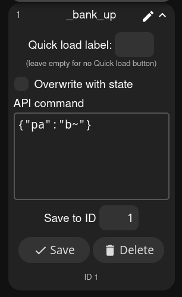

# Preset Array usermod
This usermod lets you navigate a large number of effect presets more easily. You can group effects together however you see fit into *banks* that you can navigate either between (eg bank 1 to bank 2) or within (switch between presets inside a bank). It's particularly handy for non-touchscreen interfaces, like pushbuttons or encoders.


Commands are provided to cycle up or down, with and without wrapping.

## Array notation

The pictured example above could be represented like this in the usermod settings, "Preset Banks" text area:

```
10,11,12
20,21
30,31,32,33
```

Each row is a bank, with each preset ID separated by a comma.

This is assuming you've defined presets for given effects with the ID numbers 10, 11, 12, 21... etc. It's up to you to carefully input this text, the usermod currently doesn't do any checks here. **Do not include trailing commas after banks, just a newline**. You can include a space after commas, but that just makes the stored string take up more space in memory. I suggest keeping it as shown above. The preset ID numbers do not have to be sequential or following any pattern.

## How it functions
After starting up WLED in this example, the state will be Preset 10---you will want to set this preset to be applied at boot when creating it. One option is to cycle through banks. Cycling up will apply Preset 20, and if cycling up again, Preset 30. If a wrapping command is used, then cycling up a third time will cycle back to Preset 10. From Preset 10, the other option is to cycle within a bank. Cycling up will apply Preset 11 next. Cycling down with a preset wrapping command from 10 will apply Preset 12.


## API commands
The commands are sent at the top level of the [JSON state API](https://kno.wled.ge/interfaces/json-api/), under the key `"pa"` for Preset Array. Here are some of the possible commands, the same pattern applies for both banks and presets.

| Command | Result                            |
|---------|-----------------------------------|
| `b~`    | Increment bank with wrap around   |
| `b+`    | Increment bank without wrapping   |
| `p~-`   | Decrement preset with wrap around |
| `p-`    | Decrement preset without wrapping |

Personally, for the navigation commands I'm interested in, I've defined some presets and then assigned their IDs to [buttons]. I name them with an underscore at the start so they are sorted separately. One such preset looks like this in the interface:



## Maximum number of presets, banks
By default, you can store up to 64 presets in up to 23 banks. These numbers can be increased if you have the memory for it, by redefining `USERMOD_PRESET_ARRAY_MAX_PRESETS` and `USERMOD_PRESET_ARRAY_MAX_BANKS` respectively.

## Other considerations
This usermod naively keeps track of the current position in the array. If you use the navigation commands to get to Preset 20 in our example above, and then use the web interface to apply Preset 10, sending an Cycle Bank Up command will still go to Preset 30 as if the previous state was still 20.

I like to save presets with "include brightness" unchecked, so that changing the brightness is independent to the changing of effects. In fact, on my own WLED builds I change the default of that checkbox to unchecked, by editing the file `wled00/data/index.js` and rebuilding the web interface with npm before compiling.

## Advanced ideas
A preset in the array can be applying effects to multiple LED segments.

A separate default applied preset can make sense, which is a copy of the first preset in the array *except with a brightness included*. I set this to a sane initial brightness and have buttons to separately control brightness.
